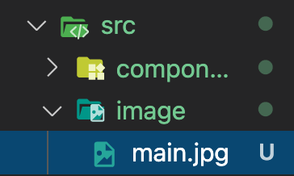

# React에서 이미지 불러오기(public, src)

React에서는 저장된 이미지가 public폴더에있는지 src폴더안에 있는지에 따라 불러오는 방법이 다르다.

## public 폴더에 저장할 경우


public > images에 저장되어있는 이미지를 불러오기 위해서는 `` 태그를 사용해주면 된다.
주의 할 점은 public 폴더안의 파일은 `../src/images/main.jpg` 이런식으로 경로 설정을 해주면 이미지가 불러와지지 않는다. 위와 같이 public안의 폴더나 파일의 경로로 바로 불러와준다.

## src 폴더에 저장할 경우



src폴더 안에서 이미지를 불러오기 위해서는 img의 src에 직접 경로를 넣어주지 않고, import해와야지만, 이미지가 불러와진다. 해당 파일이 있는 위치를 상대경로로 import해오고 img의 src값으로 넣어주면 이미지가 불러와진다.

```js
import MainImg from "../src/image/main.jpg";

const App = () => {
  return (
    <div>
      
    </div>
  );
};

export default App;
```
