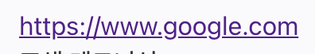
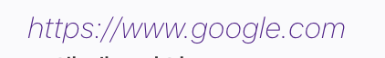
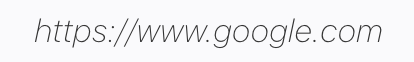
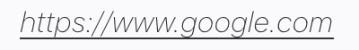

# a태그 꾸미기 (지긋지긋한 보라색 링크)



a태그를 사용하여 링크를 구현하였을 때, 한번 접속한 흔적이 있다면 위와 같이 보라색으로 표시된다.

너무 못생겨서 a태그 스타일링을 해보았다.

> styled-components를 사용하여 구현해보았다.

## 첫번째

```js
const Site = styled.a`
  font-weight: 200;
  font-style: italic;
  text-decoration: none;
`;
```

font-weight를 사용하여 폰트의 굵기를 조금 얇게 해주었고, font-style: italic로 글씨를 기울임체로 바꿔주었다. 마지막으로 text-decoration:none으로 못생긴 밑줄을 없애주었다.



## 두번쨰

```js
const Site = styled.a`
  font-weight: 200;
  font-style: italic;
  text-decoration: none;
  :link {
    color: #333;
  }
  :visited {
    color: #333;
  }
  :hover {
    border-bottom: 1px solid #333;
  }
`;
```

:link는 방문하지 않았을 때의 스타일을 적용해준다.

:visited는 방문하였을 때의 스타일을 적용해준다.

:hover는 커서가 링크 위에 올라갔을 때의 스타일을 적용해준다.

나는 방문하였을 때 하지 않았을 때 모두 color를 같게 해주었고, 커서가 마우스 위로 올라갔을 때 밑줄이 나오게 설정하였다.

일반적일 때,


커서를 링크 위에 올려두었을 때,


이 외에도 클릭할 때, 스타일을 적용해주는 :active가 있다.
