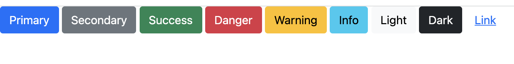
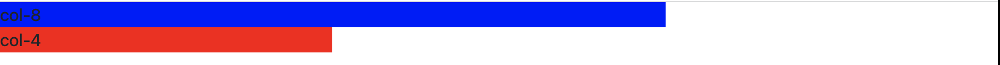
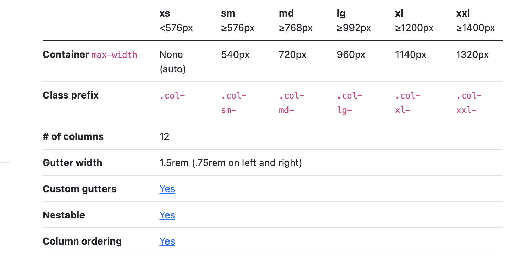

# 부트스트랩(bootstrap)

부트스트랩은 이미 만들어진 컴포넌트를 사용함으로써 협업시에 디자인의 불일치 문제를 해결하고, 반응형 등의 직접 구현할 때의 방대한 코드와 css에 대한 깊은 이해도 없이도 빠르게 프론트개발을 할 수 있게 도와주는 프레임워크이다. 특히 반응형을 쉽게 구현할 수 있는 부분이 좋다고 느껴진다.

## 시작하기

[부트스트랩](https://getbootstrap.com/docs/5.1/getting-started/introduction/)페이지에 있는 link태그를 복사해서 head태그안에 넣어 준다.

```html
<!DOCTYPE html>
<html lang="ko">
  <head>
    <title>Document</title>
    <link
      href="https://cdn.jsdelivr.net/npm/bootstrap@5.1.3/dist/css/bootstrap.min.css"
      rel="stylesheet"
      integrity="sha384-1BmE4kWBq78iYhFldvKuhfTAU6auU8tT94WrHftjDbrCEXSU1oBoqyl2QvZ6jIW3"
      crossorigin="anonymous"
    />
  </head>
  <body></body>
</html>
```

이제 부트스트랩을 사용할 수 있게 되었다. 버튼을 생성해보기 위해서 [부트스트랩](https://getbootstrap.com/docs/5.1/components/buttons/) 웹 페이지에서 button을 검색하고 원하는 디자인의 코드를 복사해서 붙여 넣으면, 바로 적용이 된다.



버튼 외에도 사용하고 싶은 컴포넌트를 검색하여 사용할 수 있다.

## 반응형 이해하기(grid)

부트스트랩을 통해 반응형을 적용시키고 싶다면, grid 시스템에 대해서 알아야한다. grid는 웹 페이지를 12등분으로 나눈다고 생각하면 된다. class에 col,row 설정으로 항상 비율을 유지할 수 있다.

```html
<body>
  <div class="col-8" style="background-color: blue">col-8</div>
  <div class="col-4" style="background-color: red">col-4</div>
</body>
```

이렇게 col-8과 col-4를 class 값으로 주면 화면 크기가 변하여도 8/12, 4/12의 비율을 항상 유지하게 된다.



이 뿐 아니라, 해상도에 따라 다르게 적용 할수도 있다.

[부트스트랩 grid](https://getbootstrap.com/docs/5.1/layout/grid/)을 보면 해상도 별로 어떻게 설정할지에 대해 나와있다.



```html
<body>
  <div class="col-8 col-lg-12 col-md-4" style="background-color: blue">
    col-8
  </div>
  <div class="col-4 col-lg-10 col-md-2" style="background-color: red">
    col-4
  </div>
</body>
```

위와 같이 작성하고 화면을 조절하면 해당 해상도에 따라 입력한 col비율이 적용된다. 잘 사용하면 아주 유용하게 쓸 수 있을 것 같다.

> <span style='color:green'>현재 개발공부중이며, 해당 글에 틀린 내용이 있을 수 있습니다. 부족한 부분에 대해서 피드백을 주시면 수정하겠습니다.</span>

# 참고

[HTML/JS/CSS로 나만의 심리테스트 사이트 만들기](https://www.inflearn.com/course/%EC%8B%AC%EB%A6%AC%ED%85%8C%EC%8A%A4%ED%8A%B8-%EC%82%AC%EC%9D%B4%ED%8A%B8-%EC%A0%9C%EC%9E%91/dashboard)
