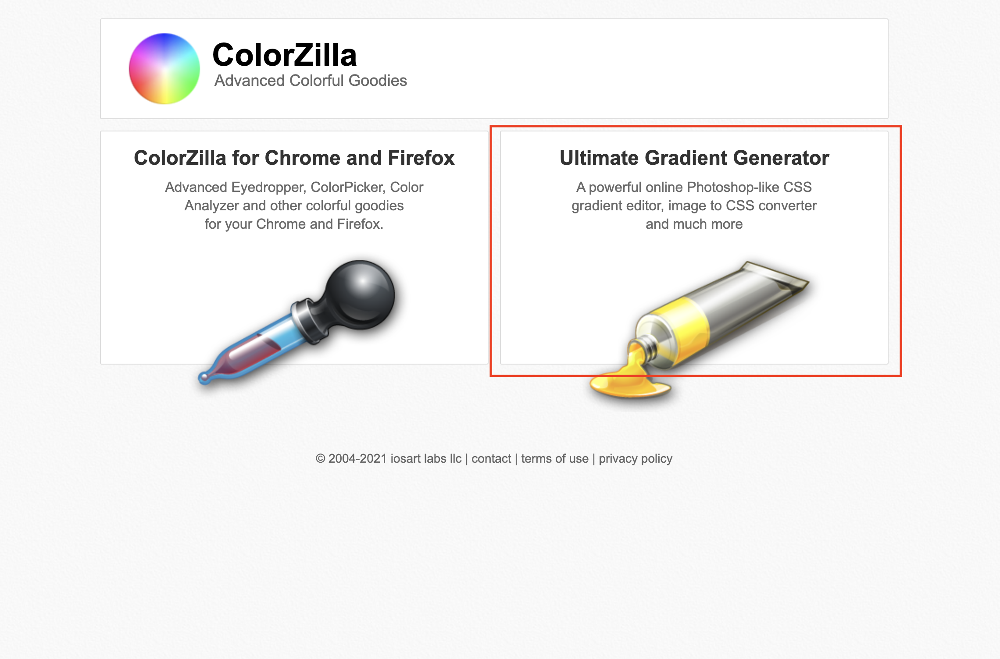
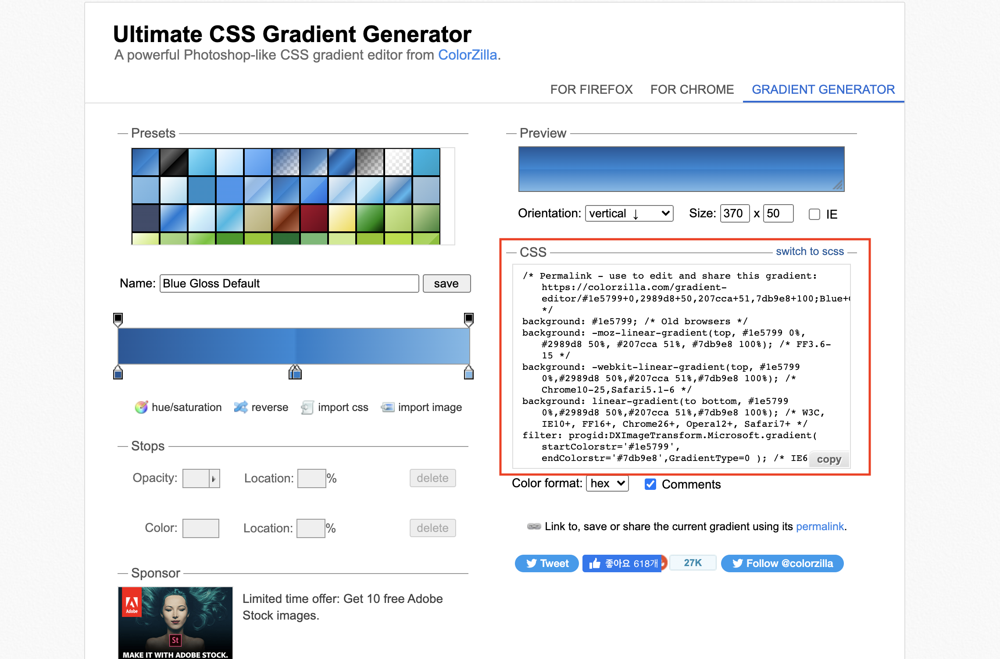

# css 그라데이션(gradation) 컬러 사용하기

한번씩 웹페이지에 단색이 아니라 그라데이션이 있는 컬러를 넣고 싶을 때가 있다. 그라데이션 컬러를 적용하고 싶다면, [colorzilla](https://www.colorzilla.com/) 웹사이트를 이용해보자.

웹 사이트에 접속 후, generater로 들어간다.

원하는 색상을 조정하면, 빨간색 상자에 css가 조정한 색상에 맞게 맞춰진다. 그리고 복사해서 내 프로젝트에 붙여넣으면 바로 사용이 가능하다.
