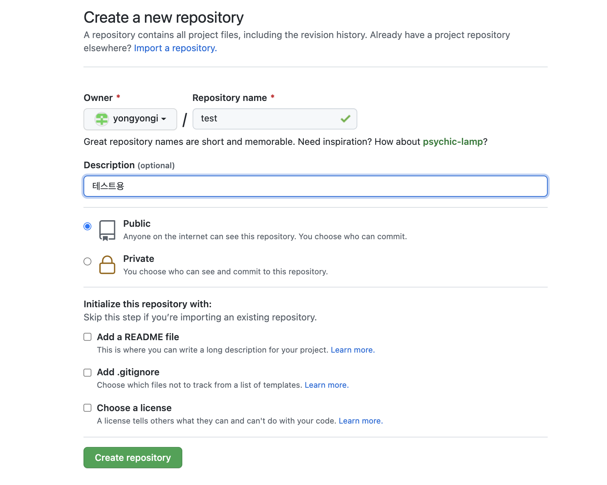
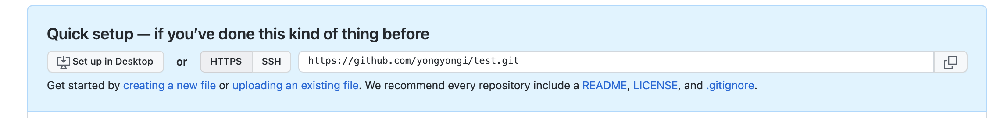

# git으로 프로젝트 시작하기

지금은 익숙해졌지만, 프로젝트를 처음 할 당시에는 프로젝트를 어떤 식으로 시작해야할지 몰랐다. 그래서 프로젝트를 시작하는 방법을 정리해보았다.

우선 나는 git을 사용하여 github 원격저장소에서 프로젝트를 관리한다. (대부분 개발자들이 사용함.)

1. github에 새로운 repository를 생성한 후, 주소를 복사한다.

2. CLI 명령어로 프로젝트 폴더로 들어가서 프로젝트 폴더 주소에서 `git init` 명령어를 입력한다. 경우에 따라 다르지만, 빠른 생성을 위해서 `git init -y`를 해주어도 된다.

3. 이제 github에서 만든 repository를 관리하기 위해 `git remote add origin [1번에서 복사한 주소]`를 입력한다. (origin대신 사용하고 싶은 이름을 넣어도 되지만, origin을 많이 사용한다.)

4. 이제는 git으로 github저장소를 관리할 수 있게 되었다. `git commit -m"[커밋내용]"`을 한 다음 `git push origin master`를 하면 github repository가 업데이트가 된다.

5. 혼자서 개발하지 않고 여러명이서 개발하는 경우, 이 저장소 주소를 `git clone [저장소 주소]`하여 가져올 수 있고, `git pull origin master`으로 다른 사람이 업데이트한 내용을 가져와 코드를 업데이트 할 수도 있다.
