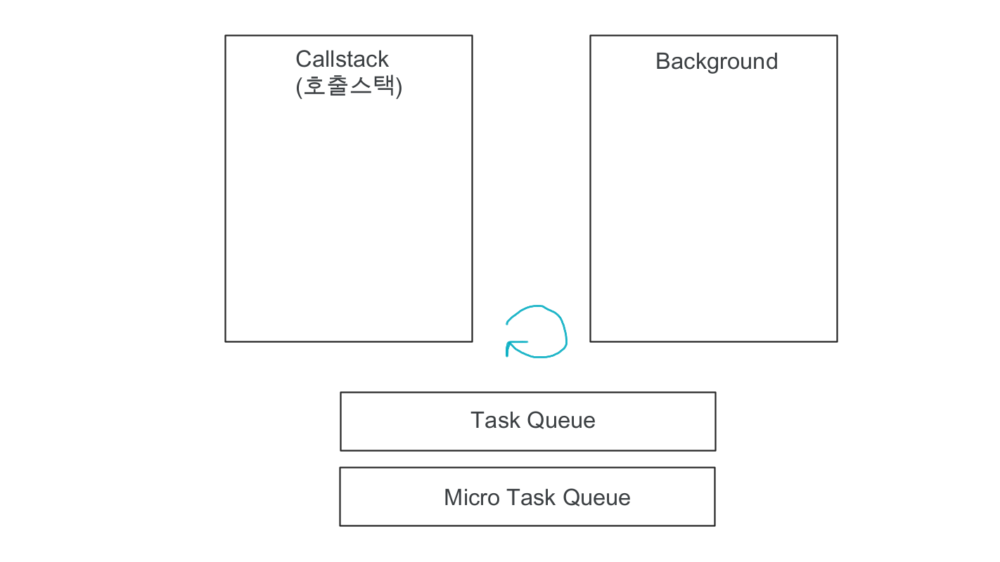

# Event Loop

자바스크립트 자체는 싱글 쓰레드이지만, 다른언어로 이루어진 백그라운드로 인해서 멀티 쓰레드가 가능하다. 그래서 작업을 동시에 처리할 수 있다. 이렇게 멀티 쓰레드로 구동되는 방식을 Event Loop라고 한다.

구성은 콜스택(호출스택), 백그라운드, 태스크큐, 마이크로 태스크 큐로 구성되어이다.



```js
function a() {
  b();
  console.log("1");
}

function b() {
  c();
  console.log("2");
}

function c() {
  console.log("3");
}

a();
```

위 코드를 실행하였을 때, 호출 스택에 a(),b(),c()순서로 쌓이게 되고 c()함수 부터 종료가 되면서 3,2,1순으로 출력이 된다.

이와 같이 호출 스택으로 이루어진 자바스크립트 코드라면 단순하지만, 비동기 함수가 포함된다면, Event Loop에 대해서 알아야한다.

비동기 함수에는 setTimeout, setInterval, ajax통신 등이 있다. 처리되는 방식은 역시 호출 스택에 먼저 쌓이고, 바로 백그라운드로 이동한다. 여기서 호출 스택과 백그라운드는 동시에 실행된다.

주의할 부분은 호출스택에 있는 작업보다 백그라운드 작업이 먼저 끝났다고 하여도 호출 스택에 있는 것들이 먼저 출력이 된다. 백그라운드에서 끝난 작업은 태스크 큐로 이동하여 쌓여 있다가 호출 스택이 비었을 때, 호출 스택으로 이동히여 실행 된다.

태스크 큐와 마이크로 태스크 큐가 있는데, 이는 우선순위의 차이다. 마이크로 태스크 큐가 우선적으로 호출 스택으로 이동하여 실행된다. 예를 들어 Promise의 then/catch, process.nextTick 등이 있다.
(promise는 내부까지는 동기지만, then을 만나는 순간 비동기로 된다.)

Event Loop의 원리는 이해하였지만, 아직 실행되는 순서를 조금씩 틀릴때가 있다. 아무렇게나 코드를 작성해보고 실행되는 순서를 맞추는 연습을 해보면 좋을 것 같다.

> <span style='color:green'>현재 개발공부중이며, 해당 글에 틀린 내용이 있을 수 있습니다. 부족한 부분에 대해서 피드백을 주시면 수정하겠습니다.</span>

## 참고

Node교과서 - 제로초
