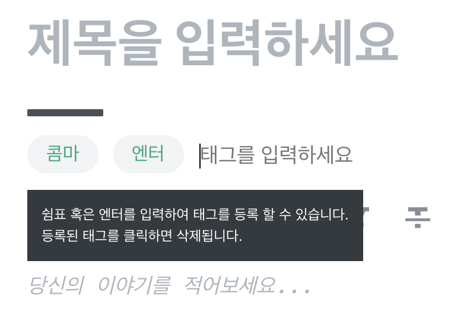

# onKeyPress

보통은 Input창에서 '확인'버튼을 눌렀을 경우 어떠한 이벤트를 발생시킨다. '확인' 버튼 뿐만 아니라 ',' 나 'enter' 등 특정 키를 클릭하였을 경우에 이벤트를 발생시키고 싶었다. 실제로 velog에서도 태그 추가시 사용되는 기능이다.



이외에도 많이 사용되어 구글링을 해보니 input태그의 onKeyPress속성을 통해서 이벤트를 발생시킬 수 있었다.

```js
import React from "react";

const testComponent = () => {
  const test = ({ code }) => console.log(">>>", code);

  return <input onKeyPress={test} />;
};
```

> 여기서 code는 원래 e.code이지만, 구조분해할당을 통해서 {code}로 바로 가져왔다.

이제 input창에 자판을 누를때 해당 자판의 고유값을 불러오게 되고, 이 값을 분기하여서 어떠한 함수를 실행시키거나 state를 변경시키는 등 다양한 이벤트를 줄수 있게 된다.
