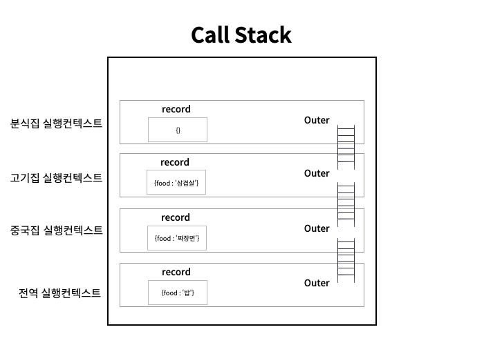

## 👉 Outer와 스코프체이닝


💡 Outer : 이전 렉시컬 환경을 가리키기 때문에 타고타고 내려갈 수 있다. <br/>
정식 명칭 : Outer Enviroment Reference(외부 환경 참조)

💡 Scope Chaining : 상위 스코프와 연결되어 있어 참조할 수 있는 것

Outer를 통해 Scope Chaining을 할 수 있게 된다.

Outer는 현재 렉시컬 환경에서 참조할 식별자가 없다면, 이전의 렉시컬 환경으로 가서 식별자를 찾는다. 이렇게 찾을 때까지 찾아 내려가고, 식별자를 발견한다면 그 식별자의 값을 출력하고 더 이상 이전 렉시컬 환경으로 내려가지 않기 때문에 콜스택 공간안에 동일한 식별자가 여럿이어도 값을 결정할 수 있다. 이것을 식별자 결정이라고 한다.

예시를 통해 알아보자.

```jsx
let food = "밥";

function 중국집() {
  let food = "짜장면";

  function 고기집() {
    let food = "삼겹살";

    function 분식집() {
      console.log(food);
      console.trace();
    }
    분식집();
  }
  고기집();
}
중국집();
```



위와 같은 코드는 위 그림과 같은 순서로 콜스택에 쌓이고, outer로 스코프체이닝이 되는 상태이다. 그렇기 때문에 현재 활성화 된 실행 컨텍스트(제일 위에 쌓인 컨텍스트)부터 시작하여서 food의 값을 찾기 시작한다. 활성화 된 분식집 함수에 food식별자가 없기 때문에 outer를 통해 이전의 렉시컬 환경을 참조하여 고기집 함수에 있는 “삼겹살”을 참조하게 된다. 그리고 더 이상 내려가지 않고 출력되기 때문에 “삼겹살” 이라는 값이 나오게 된다.

밑에 코드를 보자.

```jsx
let food = "밥";

function 중국집() {
  let food = "짜장면";
  고기집();
}

function 고기집() {
  let food = "삼겹살";
  분식집();
}

function 분식집() {
  console.log(food);
  console.trace();
}

중국집();
```

이 코드는 언뜻보면 위에 코드와 비슷해보인다. 그리고 똑같이 중국집 함수안에서 고기집 함수를 고기집 함수안에서 분식집 함수를 호출한 상태이다. 심지어 콜스택에 쌓이는 순서도 똑같다. (console.trace()를 통해서 확인할 수 있다) 하지만, 이 코드에서 food의 값은 “삼겹살”이 아닌 “밥”을 출력한다.

그 이유는 스코프체이닝 범위 때문이다. 처음 작성한 코드는 함수안에 함수가 작성되고 호출되는 구조였기 때문에 분식집 상위 스코프가 고기집이고, 고기집 상위 스코프가 중국집이고, 중국집 상위 스코프가 글로벌이 된다. 그래서 이들은 서로 스코프체이닝이 가능하다.

하지만, 두번째 코드는 모든 함수들이 글로벌에서 선언되었기 때문에 함수호출이 다른 함수 안에서 이루어졌다고 해도 선언된 곳을 기준으로 상위 스코프는 모두 글로벌이기 때문에 분식집 안에서 food를 찾지 못할 경우 글로벌에서 변수를 참조하게 된다. 이렇기 때문에 스코프체이닝 범위가 첫번째 코드와 다르게 되고 결과값이 다르게 된다.

아직 실행 컨텍스트에 대해서 알아야할 내용들이 많은 것 같다. 더 공부하고 확실하게 정리해보자.
