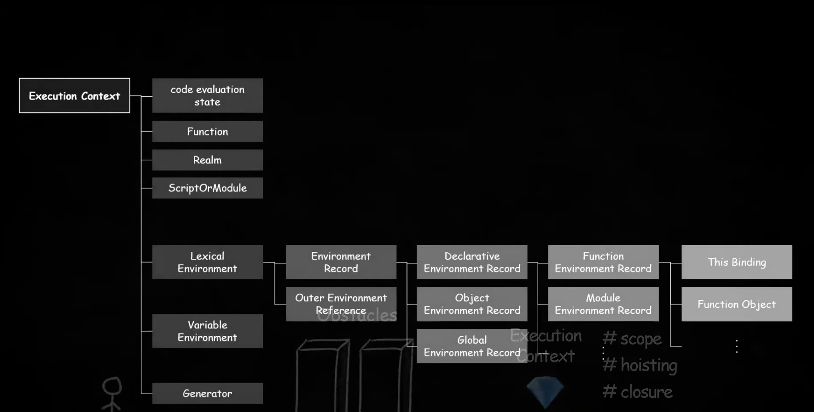
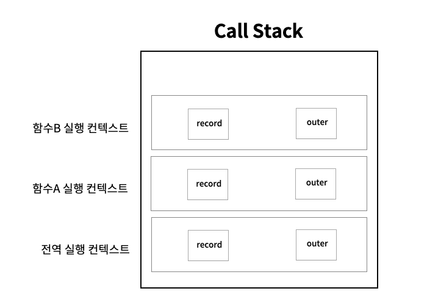
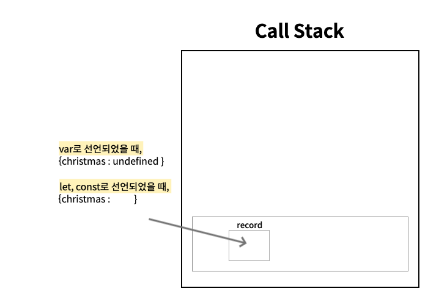
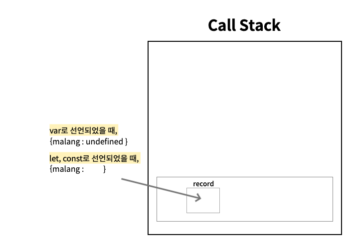
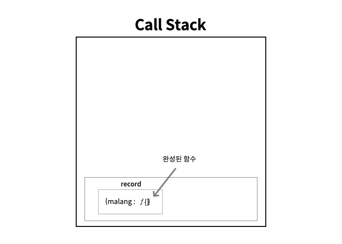

# 실행 컨텍스트(Execution Context)

자바스크립트를 사용하면서 실행 컨텍스트에 대해서 전혀 모르고 있었다. scope, hoisting, closure개념도 자바스크립트를 사용하면서 감각적으로 알고 있는게 전부였다. 그러던 도중에! [우아한 테크톡의 하루님의 실행컨텍스트](https://youtu.be/EWfujNzSUmw) 발표를 들으면서 실행 컨텍스트를 왜 알아야 하는지 알게 되었고 자바스크립트의 원리에 대해서 좀 더 알 수 있었다. 이전에 공부했던 이벤트 루프와 관련되어 있어서 같이 공부하면 이해하는데 더 도움이 될 것 같다.

## 👉 실행 컨텍스트란?

- 코드를 실행하는데 필요한 환경을 제공하는 객체
- 코드를 실행하는데 필요한 조건이나 상태를 모아둔 객체
- 식별자 결정을 더욱 효율적으로 하기 위한 수단
- scope, hoisting, closure의 동작원리를 담고 있는 자바스크립트의 핵심 원리



실행 컨텍스트의 학습 범위....

이 중에서 lexical environment(렉시컬 환경)의 record와 outer에 대해서 알아보자!

## 👉 실행 컨텍스트는 언제 생길까?

자바스크립트 코드를 실행하면, 맨 처음 전역 실행 컨텍스트가 생기고 전역에 함수가 있다면, 해당 함수의 실행 컨텍스트가 Call Stack에 쌓이게 된다. 그 실행 컨텍스트는 record와 outer를 포함하고 있다. 그리고 이 함수가 종료가 되면 실행 컨텍스트는 사라진다.

```jsx
const A = () => {
  console.log("A함수");
  B();
};

const B = () => {
  console.log("B함수");
};

A();
```



## 👉 Record와 Hoisting

실행 컨텍스트 안의 Record를 알게 되면, Hoisting에 대해 보다 깊은 이해를 할 수 있다.

<aside>
💡 Record(환경 레코드) : 식별자와 식별자에 바인딩 된 값을 기록해두는 객체.
정식명칭은 Environment Record이다.

</aside>

<aside>
💡 Hoisting : 선언문이 마치 최상단에 끌어올려진 듯한 현상, 변수를 선언하기 전에도 변수를 참조할 수 있는 현상

</aside>

Hoisting은 Variable Hoisting(변수 호이스팅)과 Function Hoisting(함수 호이스팅)으로 나눌 수 있다.

## 📌 Variable Hoisting(변수 호이스팅)

- var
- let, const

```jsx
console.log(christmas);

var christmas = "토요일";
// const christmas = '토요일'
// let christmas = '토요일'

console.log(christmas);
```



### 1. 생성 단계

⇒ 실행 컨텍스트를 생성하는 단계이다.

1. 자바스크립트 코드를 실행하면, 전역 실행 컨텍스트를 생성하여 Call Stack에 넣는다.
2. 전체 코드를 스캔하면서 선언문만 찾아 실행 컨텍스트의 Record에 미리 선언해둔다.
3. - **var일 경우 ⇒** undefined로 초기화 해둠
   - **let, const일 경우 ⇒** 값을 초기화 해두지 않음

### 2. 실행 단계

⇒ 선언문 외에 나머지 코드를 순차적으로 실행하는 단계이다. 필요한 경우 생성단계에서 Record에 저장해둔 기록을 참고하거나 업데이트 하게 된다.

1. 첫줄이 실행되면서 Record에 바인딩 되어있는 값을 참고하여 var일 경우 `undefined`를 출력하고, let이나 const일 경우에는 `Reference Error`가 발생한다.
2. 두번째 줄에서 christmas를 ‘토요일’로 업데이트를 하면서 전역 실행 컨텍스트의 christmas의 값이 ‘토요일’로 업데이트 된다.
3. 세번째 줄에서 환경레코드에 christmas에 바인딩된 값은 ‘토요일’이기 때문에 ‘토요일’을 출력한다.

<aside>
💡 이처럼 var선언문이 있음에도 ES6에서 let, const가 추가되고 사용되는 것을 보면 자바스크립트도 일반적인 언어들처럼 선언라인 이전에는 변수를 참조할 수 없게 언어 차원에서 보완 되었다고 볼 수 있다.

</aside>

## 📌 Function Hoisting(함수 호이스팅)

- 함수 표현식
- 함수 선언문

### 함수 표현식

⇒ 변수에 함수를 담은 방식
⇒ 변수 호이스팅과 동일하게 동작한다.

```jsx
malang();

var malang = () => {
  // 로직들...
};

/*
const malang = () => {
	// 로직들...
}
let malang = () => {
	// 로직들...
}
*/
```



- var

이 경우 변수 호이스팅과 같이 Record에 malang이라는 식별자를 선언해두고 값을 `undefined`로 초기화 해두기 때문에 첫번째 줄의 malang값으로는 `undefined`이지만, `undefined`는 호출될 수 없기 때문에 `Type Error`가 발생한다.

- let, const

const나 let으로 함수를 선언하였을 때는 malang이 Record에 선언은 되었지만, 값이 초기화 되어있지 않기 때문에 `Reference Error`가 발생하게 된다.

### 함수 선언문

⇒ function으로 선언한 함수
⇒ 선언과 동시에 함수가 생성되어 선언 전에도 함수를 사용할 수 있음

```jsx
malang();

function malang() {
  // 로직들...
}
```



함수 선언문을 사용하면, 생성단계에서 선언문을 스캔하여 Record에 malang을 저장하고 완성된 함수 객체를 초기화 해두기 때문에 실행단계에서 malang()을 실행하면 malang함수 값이 잘 출력이 된다.

> outer와 스코프체이닝은 다음 이 시간에...
