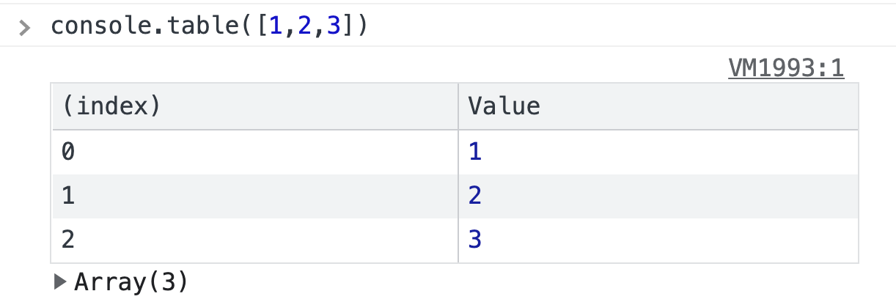

# console 종류

1. console.log
   - 평범한 로그
   - 일반적으로 찍어 볼때
2. console.dir
   - 객체 로깅
   - 객체를 볼때 dir로 보는게 더 좋다.
3. console.time, console.timeEnd
   - 시간 로깅
   - time과 timeEnd 사이의 코드가 실행되는데 걸리는 시간을 측정.
   - 코드 효율성 테스트

```jsx
//사용법
console.time("test");
//시간 측정하고 싶은 알고리즘
console.timeEnd("test");
```

4.  console.error
    - 에러 로깅
5.  console.trace
    - 호출 스택 로깅
    - 이벤트 루프 원리 연습할 때 유용
6.  console.table
    - 배열안의 객체를 테이블 형식으로 로깅
      
