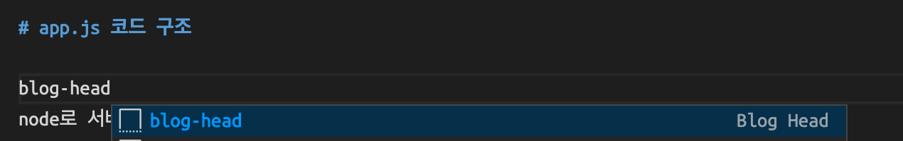

# VSCode에 자동완성 만들기(snippets)

블로그 글을 작성할 때, 혹시라도 틀린 내용이 있을까봐 아래와 같은 문장을 항상 상단에 작성하였다.

 

> 현재 개발공부중이며, 해당 글에 틀린 내용이 있을 수 있습니다. 부족한 부분에 대해서 피드백을 주시면 수정하겠습니다.

 

매번 작성하기 너무 귀찮아서 방법을 찾아 보았고, vsc기능에 snippets를 만드는 기능이 있었다.

 

## snippets 만드는 방법

vsc하단 왼쪽에 보면 설정 아이콘이 있다. 설정 아이콘에서 user snippets를 선택한다.

 

선택을 하게 되면 위와 같이 검색창 같은 것이 뜬다. 나는 README에서 사용할 마크다운 snippets이 필요하기 때문에 markdown 검색하였다.

만약, 다른 언어에서 사용할 경우 해당 언어를 검색하면 된다.

 

클릭을 하면 markdown.json 페이지로 들어가지고, 주석에 사용방법이 작성 되어있다.

 

prefix는 데이터를 불러올 때 사용할 키워드를 지정하는 곳이다. 배열 형식으로 여러 키워드로 불러올 수 있게 할 수 있다.
body에는 내가 불러올 데이터를 작성하는 곳이다. 배열안에 작성해야하고, 요소 하나가 한 줄에 해당된다.
description에는 이 데이터가 어떤 데이터인지 설명을 적는 곳이다.

markdown.json에 작성이 끝났으면, 이제는 README 파일에서 설정한 키워드를 통해 데이터를 불러올 수 있다! 😎

 

### 음?? 왜 안되지?..

 

여기서 자동완성이 만들어지는 사람도 있고, 아닌 사람도 있을거다.

내 키워드는 blog-head인데 작성하여도 아무런 반응이 없었다. 그렇다. 단축키를 모르고 있었던 것이다.

단축키 설정은 똑같이 vsc의 왼쪽 하단의 설정 아이콘을 누르고, keyboard shortcuts를 클릭한다. 여기에서 suggest라고 검색을 하면,

 

이렇게 나온다. 이 세가지는 똑같기 때문에 아무거나 선택해서 편한 단축키로 바꾸어 놓자.

 

나는 option + spacebar로 단축키를 바꾸고, 다시 README 파일에서 blog-head를 작성하고 단축키를 눌러보았다.

 

짜잔!

snippets으로 나만의 데이터 만들기 완성. 이제 중복 작업을 줄일 수 있게 되었다. 짝짝짝

 

# 참고

[이동욱님 블로그](https://jojoldu.tistory.com/491)

[단축키 설정방법](https://ithub.tistory.com/344)
