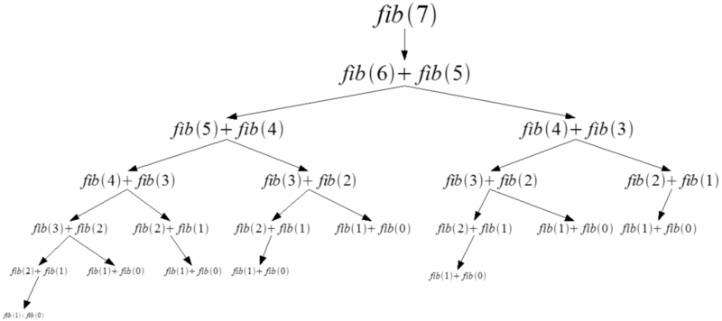

# 프로그래머스 - 피보나치 수 문제

피보나치 수는 0,1,1,2,3,5,8,13,21 ... 이런식으로 전의 수와 전전의 수를 더한 값이 계속 이어지는 수열이다.

처음에는 단순하게 재귀함수로 풀어 보았다.

```jsx
function solution(n) {
  if (n === 0) return 0;
  if (n === 1) return 1;

  return (solution(n - 1) + solution(n - 2)) % 1234567;
}
```

처음 0과 1은 그대로 리턴하고 3번째 숫자(인덱스2)부터 규칙을 적용하여 재귀로 풀었다. 하지만, 큰 수가 들어갈 때는 재귀하는 횟수가 많아 콜스택 에러, 런타임 에러가 났다. 또, 함수를 한번 호출하면 두번의 호출을 더 하기 때문에 시간 복잡도는 O(2^n)으로 매우 비효율적이다.



사진처럼 단지, 피보나치의 7번째 값을 구하기 위해서는 많은 계산 과정이 필요하다. 여기서 문제는 반복적인 계산 과정이 많다는 것이다. fib(3), fib(4) 등 반복적인 계산 과정이 많기 때문에 이미 구한 값들을 메모리에 저장하여 반복적인 과정을 없애면서 효율적인 코드를 작성해 보았다.

```jsx
function solution(n) {
  // 동적계산법(메모리 저장) - 중복된 값을 저장해서 사용
  const cache = [0, 1];

  for (let i = 2; i < n + 1; i++) {
    cache.push((cache[i - 2] + cache[i - 1]) % 1234567);
  }
  return cache[n];
}
```

참고

[피보나치](https://shoark7.github.io/programming/algorithm/%ED%94%BC%EB%B3%B4%EB%82%98%EC%B9%98-%EC%95%8C%EA%B3%A0%EB%A6%AC%EC%A6%98%EC%9D%84-%ED%95%B4%EA%B2%B0%ED%95%98%EB%8A%94-5%EA%B0%80%EC%A7%80-%EB%B0%A9%EB%B2%95.html)
