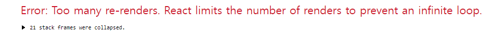

# 오늘의 에러



```jsx
// 생략
const [keyowrdCounter, setKeywordCounter] = useState(0);

items
  .filter((el) => el.folderName === folder)
  .map((keyword, idx) => {
    setKeywordCounter(idx); // 이 부분이 문제!
    return <Preview key={keyword} />;
  });

// 생략
```

처음보는 에러가 발생해서 간단하지만 기록해봤다. 보아하니 리랜더링이 많다는 것 같은데 확인해보니 mapping을 하는 곳에서 setKeywordCounter를 실행하였다. setKeywordCounter를 실행하면 state값이 바뀌고 state값이 바뀌면 리랜더링이 되기 때문에 발생하는 에러였다.

```jsx
// 생략

let keywordCounter = 0;

items
  .filter((el) => el.folderName === folder)
  .map((keyword, idx) => {
    keywordCounter = idx + 1;
    return <Preview key={keyword} />;
  });

// 생략
```

setKeywordCounter 대신에 let으로 keywordCounter를 선언하고 idx+1값을 mapping안에서 할당하여 에러를 해결할 수 있었다.
