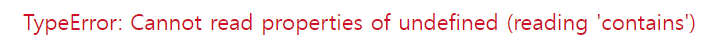

# 오늘의 에러



폴더 탭을 클릭하였을 때, 다른 폴더 리스트가 나오는 작은 모달창을 구현하였다. 이제 모달창이 제거되는 이벤트를 만들어야하는데, 감이 오질 않아서 velog를 참고하였다. velog는 작은 모달창이 띄어진 상태에서 페이지에 있는 모든 버튼들이 활성화 된 상태였고, 모달 바깥을 누르면 모달창이 꺼졌다.

나도 이러한 기능을 구현하고 싶어 구글링을 해보았고, 밑에와 같은 코드를 찾게 되었다.

```js

// 생략
const Modal = ({ setModal, modalRef }) => {

const modalRef = useRef();
const handleClickOutSide = ({ target }) => {
  if (!modalRef.current.contains(target)) {
    setModal(false);
  }
};

useEffect(() => {
  document.addEventListener("mousedown", handleClickOutSide);

  return () => document.removeEventListener("mousedown", handleClickOutSide);
});

return (
    <ModalContainer ref={modalRef}/>
)

// 생략
```

이 코드의 동작 방식은 useRef()를 담은 변수 modalRef를 모달 전체를 감싸는 컨테이너에 ref값으로 전달한다. 그러면 modalRef의 값으로 ModalContainer의 dom값을 가리키게 된다.(modalRef.current에 저장됌)

이 값을 이용하여서 모달 바깥을 눌렀을 때 모달창이 닫기게 구현이 가능해진다. 모달창의 dom은 구했고, 이제 마우스로 어딘가를 클릭한 위치의 dom을 구하기 위해 `document.addEventListener("mousedown", handleClickOutSide);`를 해준다. 그리고 `handleClickOutSide`함수 인자로 target을 받아 해당 dom값을 구할 수 있다. (구조분해할당으로 e.target을 {target}로 바꿈)

이제 이 두 dom값을 비교하여 바깥을 클릭했는지 아닌지 분기를 할 수 있다. `!modalRef.current.contains(target)` 이 코드는 current 값에 target이 포함되어있냐라는 뜻으로 Boolean값을 리턴한다. 그래서 이 코드로 바깥인지 구분하여서 setModal값을 설정하였다.

하지만, 이렇게 순탄하게 될일이 없지...


위와 같은 에러가 떴다면, 옵셔널체이닝으로 해결이 가능하다.

`!modalRef.current.contains(target)` 에서 current값이 undefined 또는 값 자체가 null이 뜨게 된다면 contains는 읽을 수 없게 된다. ref값을 부여한 태그가 어디냐에 따라 undefined값이 뜨기도 하고 null값이 뜨기도 한다. 이걸 한방에 해결하기 위해 옵셔널체이닝을 사용하여 해결했다.

위에서 useEffect를 사용하여서 addEventListener를 작성하였는데, 이렇게 한 이유는 cleanup코드로 최적화를 시켜주기 위해서라고는 하지만... 아직 정확히 어떤면에서 좋아지는지 잘 모르겠다 ㅠㅠ 눈에 보여야지 확 이해가 될 듯한데.. 이해가 된다면 다시 블로깅해야겠다.
