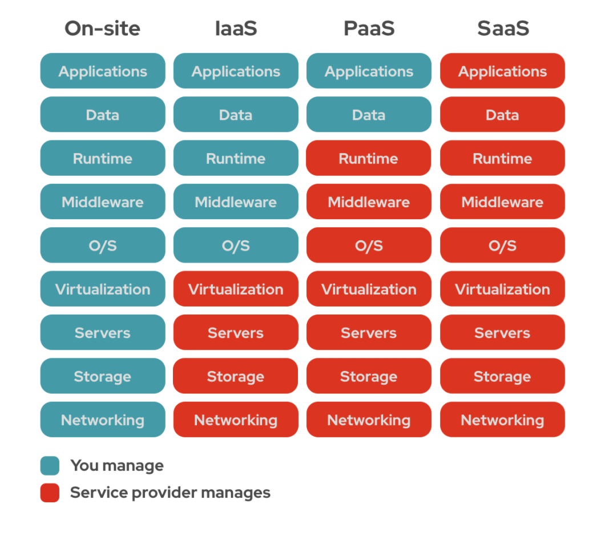

> 현재 개발공부중이며, 해당 글에 틀린 내용이 있을 수 있습니다. 부족한 부분에 대해서 피드백을 주시면 수정하겠습니다.

# IaaS, PaaS, SaaS

이 세가지 모두 클라우드 서비스이지만, 유형에 따라 제공업체에서 제공해주는 범위가 다르다.
 

밑에 그림은 유형별로 어디까지 서비스를 제공해주는지 나와있다.

출처: 레드헷

## IaaS(Infra as a service)

---

클라우드에서 가상의 서버, 인프라를 제공해주는 서비스이다. 자체적으로 보유한 전산실 서버를 운영하는 방식([온프레미스](https://ttend.tistory.com/690))에서 발전한 유형이다.

ex) AWS, Microsoft Azure, Google Cloud 등 퍼블릭 클라우드 공급업체

## PaaS(Platform as a service)

---

IaaS에서 조금 더 발전한 형태로 인프라 뿐만 아니라 플랫폼까지 제공해주는 서비스이다. AWS의 lambda서비스가 여기에 포함되는데 server less서비스로 코드만 작성하면 나머지는 제공업체에서 모두 관리해준다. 그렇기 때문에 사용자는 애플리케이션 코드에만 신경을 쓰면 된다.

ex) AWS Lambda, AWS Elastic Beanstalk, Heroku 등

## SaaS(Software as a service)

---

소프트웨어를 제공해주는 서비스로 흔히 우리가 사용하는 서비스들을 말한다. 모든 애플리케이션을 제공업체에서 관리한다.

ex) Micro365, GoogleDoc, Dropbox등 우리가 바로 사용할 수 있는 서비스이다.

> IaaS -> PaaS -> SaaS 순으로 제공업체에서 더 많은 관리를 해준다고 보면 된다.

### 참고

---

[기술노트with알렉 유튜브](https://youtu.be/Nq5JHAW8XYQ)

[레드헷 문서](https://www.redhat.com/ko/topics/cloud-computing/iaas-vs-paas-vs-saas)
